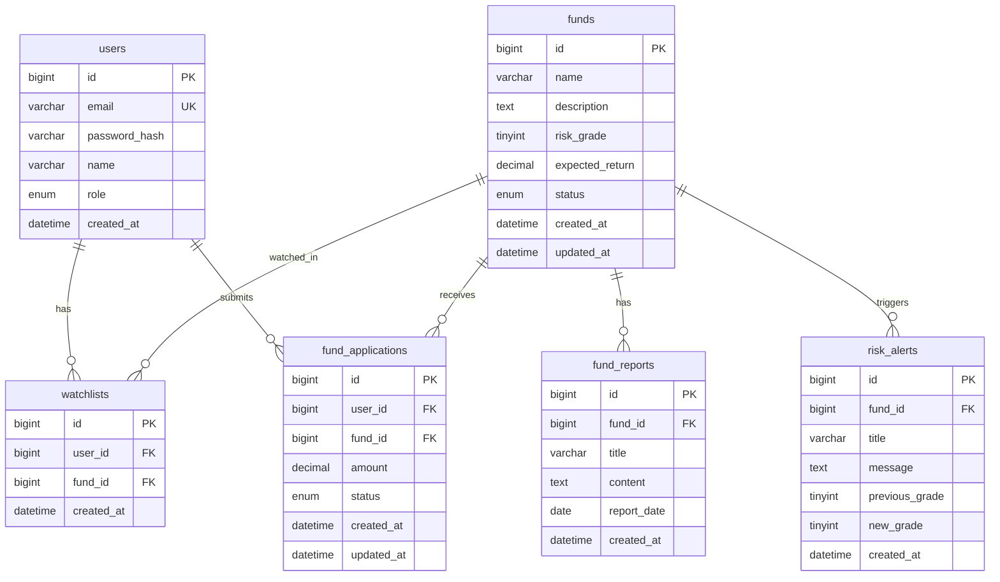

# Briefly ERD / DB Schema

| 항목 | 내용 |
| --- | --- |
| 문서명 | Briefly ERD / DB Schema |
| 버전 | v0.1 |
| 작성일 | 2026-07-03 |
| 기준 SRS | [SRS v0.1](./SRS.md) |
| 기준 SDD | [SDD v0.1](./SDD.md) |
| DBMS | MySQL 8+ / MariaDB 10.6+ |
| 문자셋 | utf8mb4 / utf8mb4_unicode_ci |
| 스키마 파일 | `back/dB/schema.sql` |
| 시드 파일 | `back/dB/seed.sql` |

---

## 1. ERD



---

## 2. 엔티티 요약

| 테이블 | SRS 매핑 | 설명 |
| --- | --- | --- |
| `users` | DR-001 | 사용자/관리자 계정 |
| `funds` | DR-002 | 투자상품 |
| `watchlists` | DR-003 | 관심상품 (User ↔ Fund) |
| `fund_applications` | DR-004 | 모의가입 신청 |
| `fund_reports` | DR-005 | 운용 브리프 |
| `risk_alerts` | DR-006 | 위험등급 변경 알림 |

---

## 3. 테이블 정의

### 3.1 users

| 컬럼 | 타입 | NULL | 기본값 | 설명 |
| --- | --- | --- | --- | --- |
| id | BIGINT | N | AUTO_INCREMENT | PK |
| email | VARCHAR(120) | N | — | 로그인 ID, UK |
| password_hash | VARCHAR(255) | N | — | BCrypt 해시 (NFR-003) |
| name | VARCHAR(80) | N | — | 사용자 이름 |
| role | ENUM('USER','ADMIN') | N | USER | 권한 (BR-006) |
| created_at | DATETIME | N | CURRENT_TIMESTAMP | 가입 일시 |

**인덱스**: `UNIQUE (email)`

---

### 3.2 funds

| 컬럼 | 타입 | NULL | 기본값 | 설명 |
| --- | --- | --- | --- | --- |
| id | BIGINT | N | AUTO_INCREMENT | PK |
| name | VARCHAR(120) | N | — | 상품명 |
| description | TEXT | Y | — | 상품 설명 |
| risk_grade | TINYINT | N | — | 위험등급 1~5 (BR-007) |
| expected_return | DECIMAL(5,2) | N | — | 예상 수익률(%) |
| status | ENUM('ACTIVE','INACTIVE') | N | ACTIVE | 상품 상태 (BR-005, BR-008) |
| created_at | DATETIME | N | CURRENT_TIMESTAMP | 등록 일시 |
| updated_at | DATETIME | N | ON UPDATE | 수정 일시 |

**인덱스**: `idx_funds_status (status)`  
**제약**: `CHECK (risk_grade BETWEEN 1 AND 5)`

---

### 3.3 watchlists

| 컬럼 | 타입 | NULL | 기본값 | 설명 |
| --- | --- | --- | --- | --- |
| id | BIGINT | N | AUTO_INCREMENT | PK |
| user_id | BIGINT | N | — | FK → users.id |
| fund_id | BIGINT | N | — | FK → funds.id |
| created_at | DATETIME | N | CURRENT_TIMESTAMP | 등록 일시 |

**인덱스**: `UNIQUE uk_watchlist_user_fund (user_id, fund_id)` — BR-002  
**FK**: `user_id` → users(id) ON DELETE CASCADE  
**FK**: `fund_id` → funds(id) ON DELETE CASCADE

---

### 3.4 fund_applications

| 컬럼 | 타입 | NULL | 기본값 | 설명 |
| --- | --- | --- | --- | --- |
| id | BIGINT | N | AUTO_INCREMENT | PK |
| user_id | BIGINT | N | — | FK → users.id |
| fund_id | BIGINT | N | — | FK → funds.id |
| amount | DECIMAL(15,2) | N | — | 모의가입 신청 금액 (FR-009, ERR-007) |
| status | ENUM(...) | N | PENDING | 신청 상태 (BR-003, BR-004) |
| created_at | DATETIME | N | CURRENT_TIMESTAMP | 신청 일시 |
| updated_at | DATETIME | N | ON UPDATE | 상태 변경 일시 |

**status 값**: `PENDING`, `APPROVED`, `REJECTED`, `CANCELED`  
**인덱스**: `idx_applications_user`, `idx_applications_status`  
**비즈니스 규칙**: `amount > 0` (Service 레이어 검증, ERR-007)

---

### 3.5 fund_reports

| 컬럼 | 타입 | NULL | 기본값 | 설명 |
| --- | --- | --- | --- | --- |
| id | BIGINT | N | AUTO_INCREMENT | PK |
| fund_id | BIGINT | N | — | FK → funds.id |
| title | VARCHAR(200) | N | — | 브리프 제목 |
| content | TEXT | N | — | 브리프 본문 |
| report_date | DATE | N | — | 리포트 기준일 |
| created_at | DATETIME | N | CURRENT_TIMESTAMP | 등록 일시 |

**조회 규칙**: `fund_id` 기준 `report_date DESC` (FR-012)  
**인덱스**: `idx_reports_fund (fund_id)`

---

### 3.6 risk_alerts

| 컬럼 | 타입 | NULL | 기본값 | 설명 |
| --- | --- | --- | --- | --- |
| id | BIGINT | N | AUTO_INCREMENT | PK |
| fund_id | BIGINT | N | — | FK → funds.id |
| title | VARCHAR(200) | N | — | 알림 제목 |
| message | TEXT | N | — | 알림 내용 |
| previous_grade | TINYINT | N | — | 변경 전 등급 |
| new_grade | TINYINT | N | — | 변경 후 등급 |
| created_at | DATETIME | N | CURRENT_TIMESTAMP | 알림 일시 |

**조회 규칙**: 사용자 관심상품(`watchlists`)의 `fund_id` 집합 기준 조회 (FR-013)  
**제약**: `previous_grade`, `new_grade` 각각 1~5 (BR-007)

---

## 4. 관계 및 카디널리티

| 관계 | 카디널리티 | 설명 |
| --- | --- | --- |
| users → watchlists | 1:N | 한 사용자가 여러 관심상품 보유 |
| funds → watchlists | 1:N | 한 상품이 여러 사용자에게 관심 등록 |
| users → fund_applications | 1:N | 한 사용자가 여러 신청 생성 |
| funds → fund_applications | 1:N | 한 상품에 여러 신청 접수 |
| funds → fund_reports | 1:N | 한 상품에 여러 운용 브리프 |
| funds → risk_alerts | 1:N | 한 상품에 여러 위험 알림 |

---

## 5. SRS 규칙 매핑

| SRS | DB/설계 반영 |
| --- | --- |
| BR-002 | `watchlists` UK(user_id, fund_id) |
| BR-003 | `fund_applications.status` DEFAULT `PENDING` |
| BR-005 | 목록 조회 시 `funds.status = 'ACTIVE'` |
| BR-008 | DELETE 대신 `status = 'INACTIVE'` |
| BR-007 | `risk_grade`, `previous_grade`, `new_grade` CHECK 1~5 |
| ERR-007 | `amount` 컬럼 + Service 검증 (`amount > 0`) |
| FR-012 | `fund_reports` ORDER BY `report_date DESC` |
| FR-013 | `risk_alerts` JOIN `watchlists` on `fund_id` |

---

## 6. 주요 조회 쿼리 초안

### ACTIVE 상품 목록 (FR-005)

```sql
SELECT id, name, risk_grade, expected_return, status
FROM funds
WHERE status = 'ACTIVE'
ORDER BY id DESC;
```

### 관심상품 기준 위험 알림 (FR-013)

```sql
SELECT ra.*
FROM risk_alerts ra
INNER JOIN watchlists w ON w.fund_id = ra.fund_id
WHERE w.user_id = ?
ORDER BY ra.created_at DESC;
```

### 상품별 운용 브리프 (FR-012)

```sql
SELECT id, title, content, report_date, created_at
FROM fund_reports
WHERE fund_id = ?
ORDER BY report_date DESC;
```

---

## 7. 초기 데이터

`back/dB/seed.sql` 기준:

| 계정 | 비밀번호 | role |
| --- | --- | --- |
| admin@briefly.com | admin1234 | ADMIN |
| user@briefly.com | admin1234 | USER |

샘플 상품 3건, 운용 브리프 2건, 위험 알림 1건 포함.

---

## 8. SDD 연계 항목

| 본 문서 | 다음 설계 산출물 |
| --- | --- |
| ERD | DAO 클래스 / ResultSet 매핑 |
| 테이블 정의 | `schema.sql` 유지보수 |
| 조회 쿼리 초안 | DAO SQL 구현 |
| 인덱스·성능 | [Data Efficiency Guide](./DATA_EFFICIENCY_GUIDE.md) |
| SRS 규칙 매핑 | Service 검증 로직 |
| 상태값 | Model enum 정의 |
